# React Native ChatGPT Clone with Clerk & RevenueCat

This is a React Native ChatGPT clone using [Clerk]([https://go.clerk.com/wvMHe8T ](https://go.clerk.com/wvMHe8T) for user authentication and [RevenueCat](https://www.revenuecat.com/docs/getting-started/installation/reactnative?utm_medium=sponsored&utm_source=youtube&utm_campaign=SimonGrimm) for In-App purchases.

Additional features:

- [Expo Router](https://docs.expo.dev/routing/introduction/) file-based navigation and API Routes
- [OpenAI API](https://platform.openai.com/) for GPT chat completions and image generation
- [Reanimated](https://docs.swmansion.com/react-native-reanimated/) 3 for animations
- [Gesture Handler](https://docs.swmansion.com/react-native-gesture-handler/) for gestures
- [Redash](https://github.com/wcandillon/react-native-redash) for animated text
- [Zeego](https://zeego.dev/start) for native menus
- [RN MMKV](https://github.com/mrousavy/react-native-mmkv) for efficient key/value storage
- [Expo SQLite](https://docs.expo.dev/versions/latest/sdk/sqlite-next/) for storing chats and messages
- [Bottom Sheet](https://ui.gorhom.dev/components/bottom-sheet/) for bottom sheet component
- [FlashList](https://shopify.github.io/flash-list/) for efficient list rendering
- [React Native OpenAI](https://github.com/candlefinance/react-native-openai) for streaming
- [Image Zoom](https://github.com/likashefqet/react-native-image-zoom) for image zoom component
- [Shimmer Placeholder](https://github.com/tomzaku/react-native-shimmer-placeholder) for loading placeholders

## Screenshots

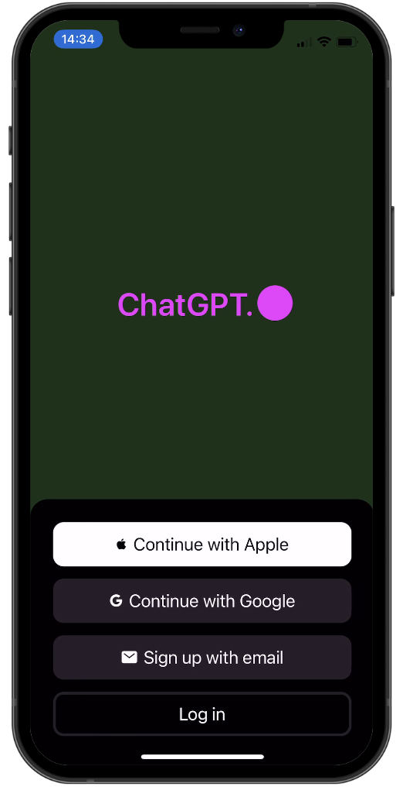
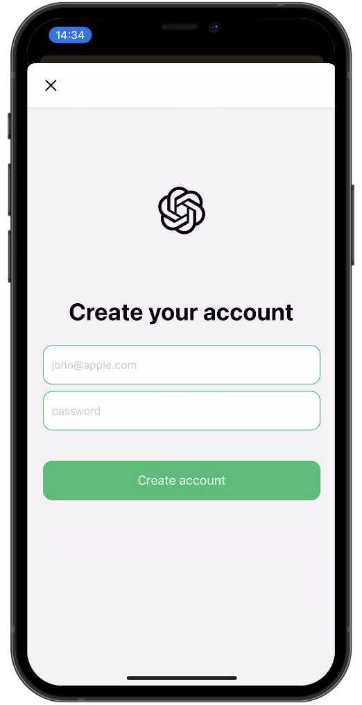
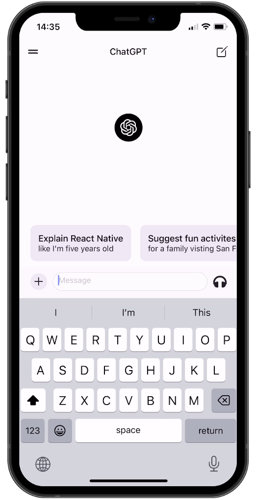
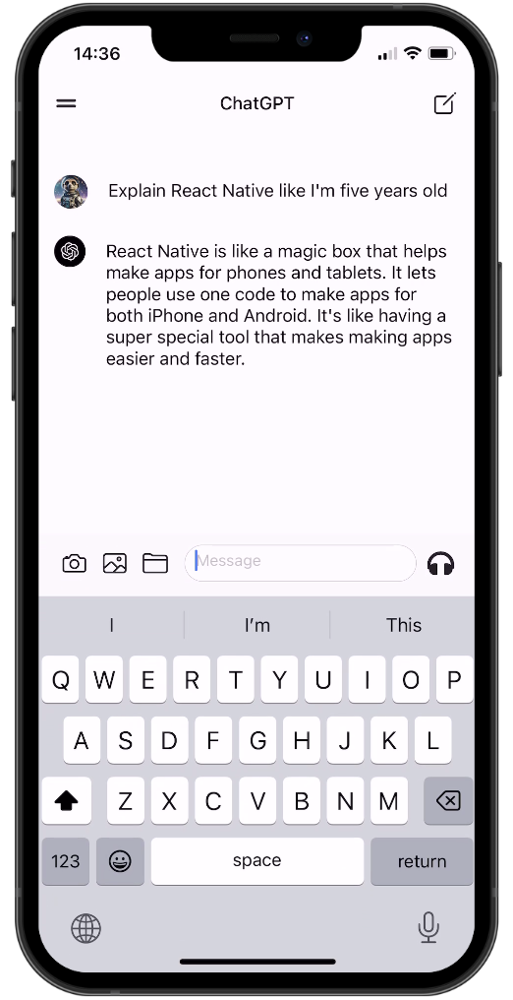
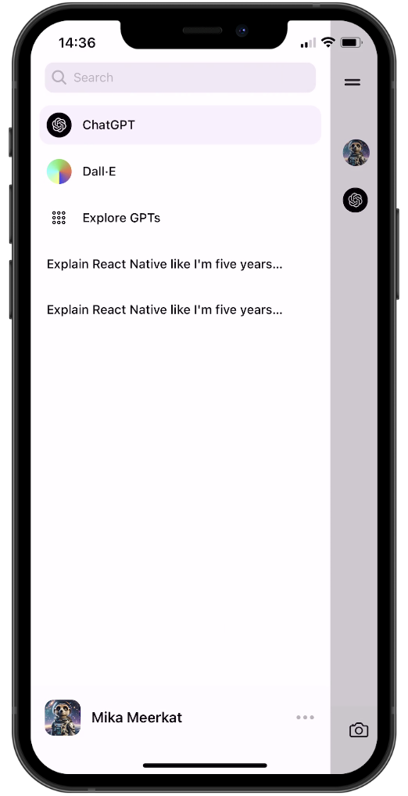

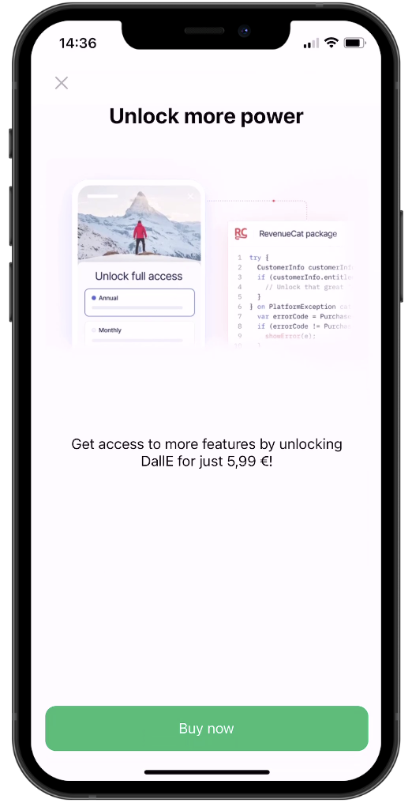
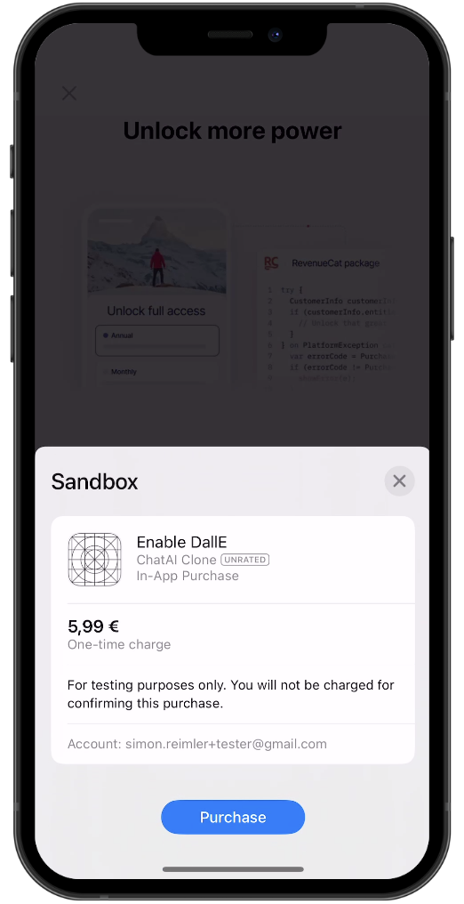
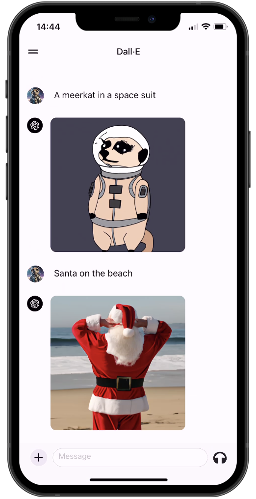
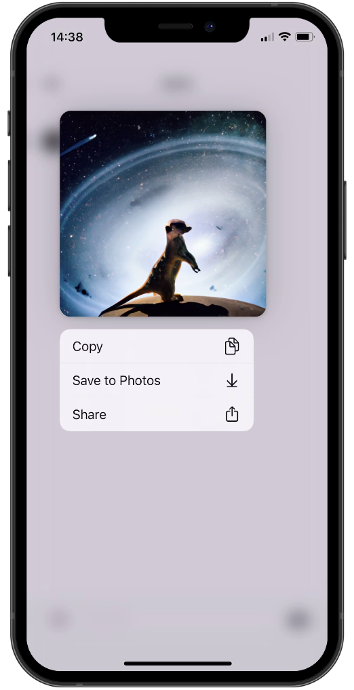
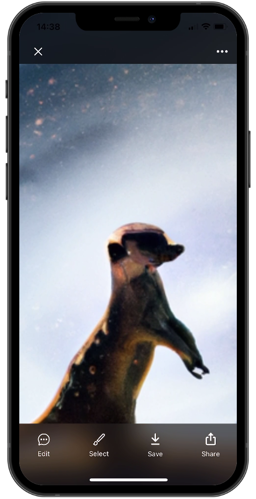
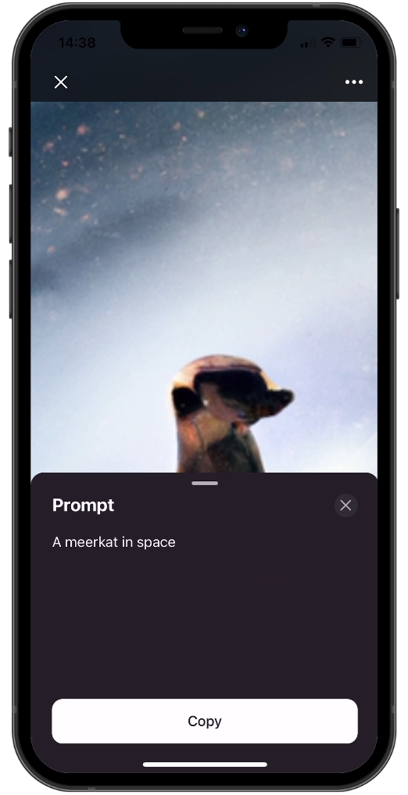
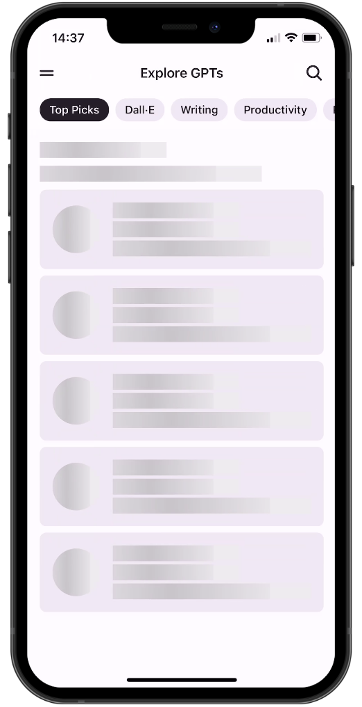

## Demo

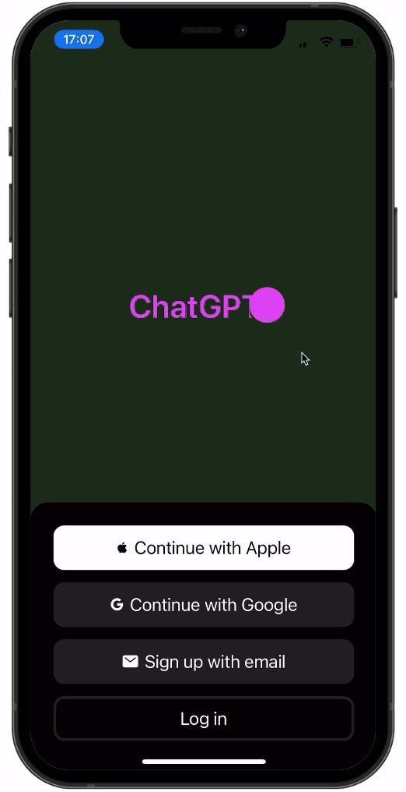
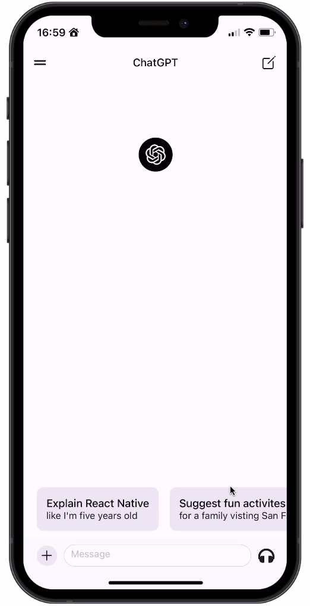
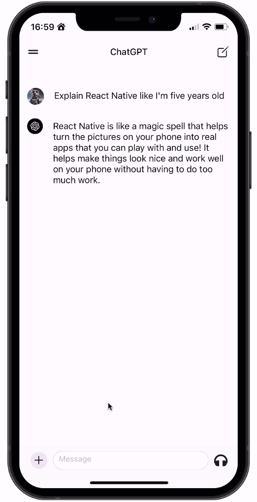

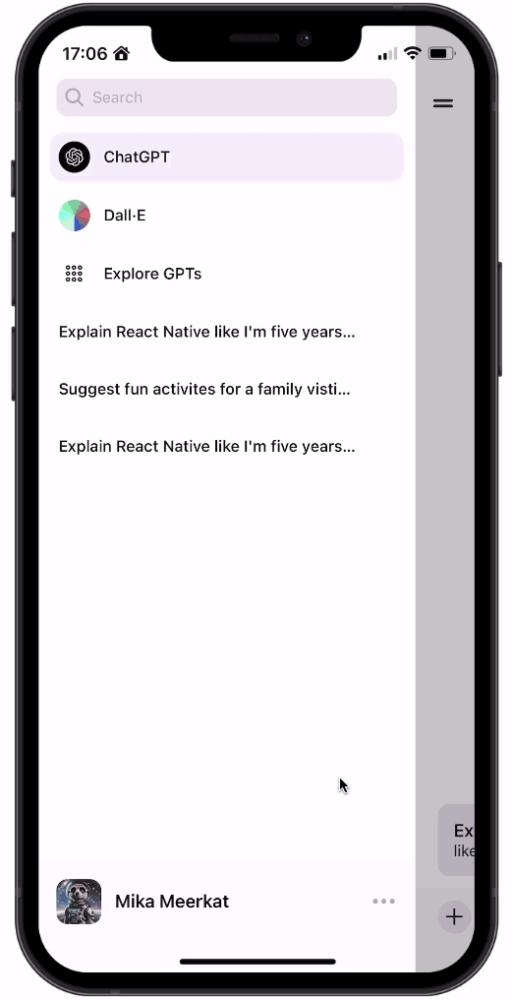

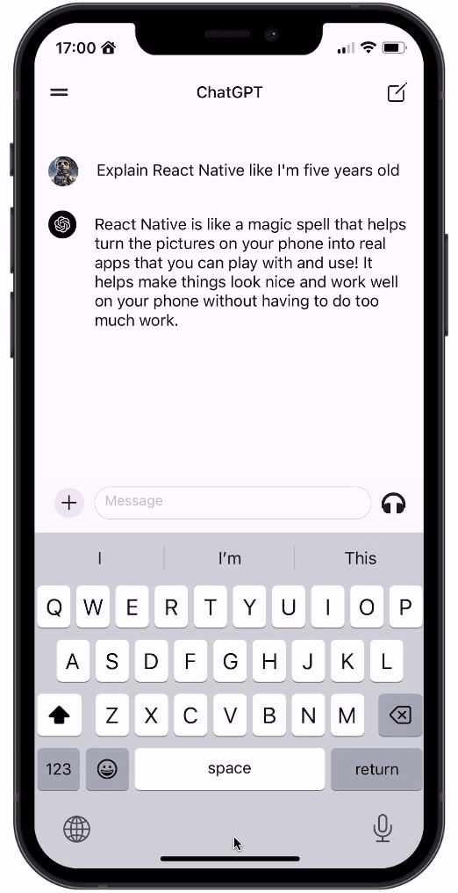
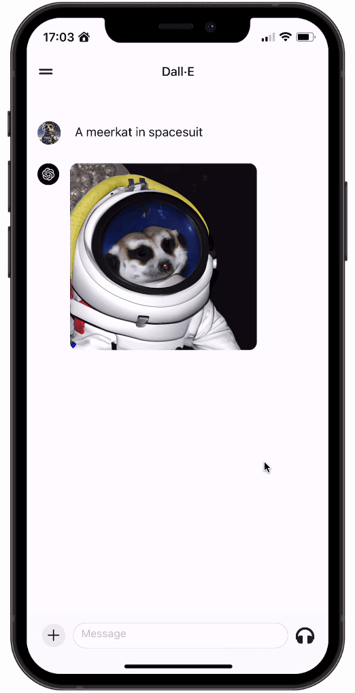

